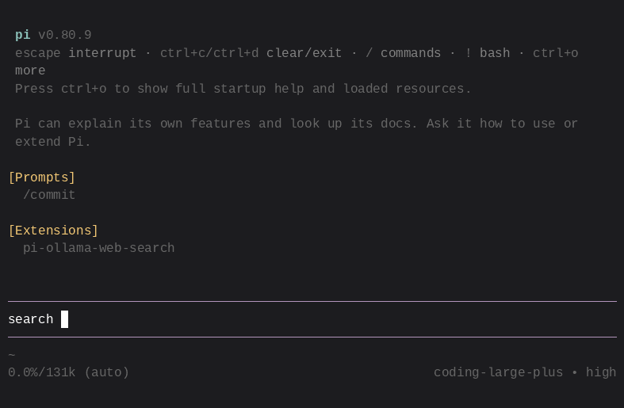

# pi-ollama-web-search

A [pi coding agent](https://pi.dev) extension that adds web search and web fetch capabilities via Ollama's hosted API.

## Why This Project

Many alternatives require a running local Ollama instance with web search enabled. This extension targets Ollama's hosted API instead — an API key is all you need, no local server setup.

It also adds rich TUI rendering so results are nicely formatted in the pi terminal UI, with compact summaries that expand to full detail. Configuration uses a discoverable config file (`~/.pi/agent/ollama-web-search.json`) with the env var as fallback.

Finally, it's intentionally a single-file extension — easy to read, fork, and modify.



## Tools

| Tool | Description |
|------|-------------|
| `ollama_web_search` | Search the web using Ollama's hosted search API |
| `ollama_web_fetch` | Fetch the content of a web page via Ollama's hosted fetch API |

## Quick Start

```bash
# Clone this repo
git clone https://github.com/simon3z/pi-ollama-web-search

# Load the extension
pi -e ./index.ts
```

Or install it as a pi package:

```bash
pi install git:github.com/simon3z/pi-ollama-web-search
```

Then it auto-loads in every session.

## Configuration

Create **`~/.pi/agent/ollama-web-search.json`** with your API key:

```json
{
  "apiKey": "sk-..."
}
```

### Legacy fallback

The `OLLAMA_API_KEY` environment variable is still supported as a fallback.

## Requirements

- Ollama API key (get one from [ollama.com](https://ollama.com))
